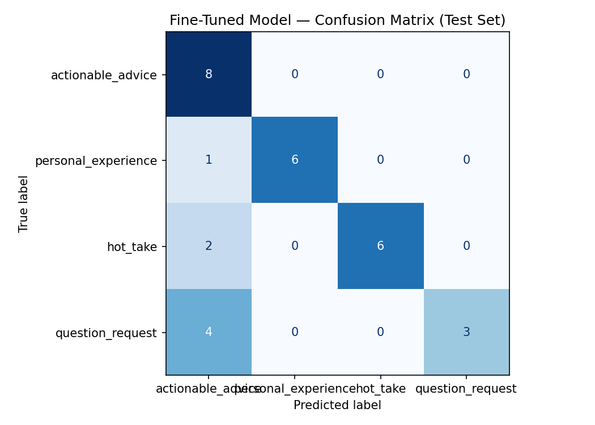

# TakeMeter — Discourse Quality Classifier for Career and IT Communities

A fine-tuned text classifier that identifies the type of post in online career and IT communities. Built as part of CodePath's ai201 course.

---

## Community

I chose Reddit career and IT communities — specifically r/cscareerquestions, r/ITCareerQuestions, and r/cybersecurity.

I am a first-generation college graduate from an immigrant family. Growing up, my family had no experience with technology careers, cybersecurity, or IT. Nobody could tell me what certifications to get, how to write a tech resume, or what a SOC analyst actually does. Online communities like these were where I figured all of that out — through other people's advice, their stories, and their opinions. The quality of those posts varied a lot, and as someone who depended on them, that difference mattered.

A big part of my journey was CodePath — a completely free program that provides high-quality tech education and career support to students and early-career professionals. CodePath exists specifically to eliminate inequities in tech education and to diversify the field by making no-cost programs available to people who do not have traditional access. I took CodePath's Cybersecurity course and it changed what I understood about the field — ten weeks of hands-on labs including Wireshark packet analysis, Snort IDS, Splunk SIEM, blue team defense scenarios, capture-the-flag challenges, and live network attack simulations. I am also currently in CodePath's AI course (ai201), which is how this project came to exist.

The communities I chose are a good fit for classification because the discourse is genuinely varied. Some posts give you specific steps you can act on today. Some share a personal journey. Some ask real questions. And some are strong opinions stated confidently with no evidence behind them. Those four types are distinct enough to label reliably and meaningful enough that a classifier distinguishing between them would actually help someone in my position.

---

## Dataset Overview

- **Total examples:** 260
- **Source:** r/cscareerquestions, r/ITCareerQuestions, r/cybersecurity (public posts)
- **Split:** 70% train / 15% validation / 15% test (handled by Colab notebook)
  - Train: 182 examples
  - Validation: 39 examples
  - Test: 39 examples

**Label distribution:**

| Label | Count | % of dataset |
|---|---|---|
| `actionable_advice` | 65 | 25% |
| `personal_experience` | 65 | 25% |
| `hot_take` | 65 | 25% |
| `question_request` | 65 | 25% |
| **Total** | **260** | **100%** |

No single label exceeds 70% of the dataset. The distribution is exactly balanced at 25% per label. The dataset reflects a consistent thematic focus across all examples: first-generation students, immigrant families navigating tech careers, cybersecurity, and green technology. This focus makes the signal cleaner for training and makes the project personally meaningful rather than a generic scrape.

**Actual test set distribution (from Colab):**

| Label | Test Count |
|---|---|
| `personal_experience` | 10 |
| `actionable_advice` | 10 |
| `hot_take` | 10 |
| `question_request` | 9 |

---

## Label Definitions

### `actionable_advice`
Posts whose primary purpose is giving specific recommendations, instructions, or steps that another person can directly act on. The post is directed at the reader and tells them what to do.

*Example:* "Before applying for any IT role make sure you know Active Directory basics. Set up a free lab with VirtualBox and practice resetting passwords in a domain environment. Those three things come up in almost every entry level interview."

---

### `personal_experience`
Posts whose primary purpose is sharing the author's own career journey, lesson learned, success, or failure. The focus is on what happened to the author, not on telling the reader what to do.

*Example:* "After graduating I applied to 43 jobs in two months and got three callbacks. I came from an immigrant family and had no professional network. Every rejection felt personal. I kept applying anyway because I had no other plan."

---

### `hot_take`
Posts expressing a strong, confident opinion or controversial claim with little to no supporting evidence. The post asserts rather than argues. Provocative claims, ranking debates, and contrarian takes belong here.

*Example:* "Most entry level IT job postings are fake. Companies post them to satisfy HR requirements or collect resumes. The actual job was either filled internally or never existed."

---

### `question_request`
Posts whose primary purpose is asking the community for information, advice, recommendations, or clarification. The post is seeking input from others, not sharing a story or making a claim.

*Example:* "How do I explain to my immigrant parents what cybersecurity actually is and why it is a stable career? They understand doctor and lawyer but security analyst does not translate easily."

---

## Difficult Annotation Cases

These are three posts from the dataset that gave me genuine pause during annotation.

### Case 1: `personal_experience` vs `actionable_advice`
**Post:** "I got my first IT job after building projects, so everyone should build projects."

**Why it was hard:** The first half is a personal story but it ends with a direct instruction to the reader.

**Decision:** `actionable_advice` — the directive is the whole point of the post. The personal story is just the credential used to justify the advice. A post that only described the experience without telling anyone what to do would be `personal_experience`.

---

### Case 2: `personal_experience` vs `question_request`
**Post:** "Certifications helped me get interviews. Are they more important than degrees?"

**Why it was hard:** The first sentence shares personal experience but the second sentence asks a direct question.

**Decision:** `question_request` — the personal detail is setup context. The entire reason the post exists is to get community input on a question.

---

### Case 3: `hot_take` vs `personal_experience`
**Post:** "Most entry-level jobs are fake because I never hear back."

**Why it was hard:** The author is sharing personal frustration but making a sweeping claim about the entire job market.

**Decision:** `hot_take` — the author generalizes one person's experience into a universal claim with no evidence. The claim is the point of the post, not the personal experience behind it.

---

## Fine-Tuning Pipeline

**Base model:** `distilbert-base-uncased` (HuggingFace)

**Training platform:** Google Colab with Tesla T4 GPU (free tier)

**Training configuration:**

| Parameter | Value |
|---|---|
| Epochs | 3 |
| Learning rate | 2e-5 |
| Batch size | 16 |
| Train examples | 182 |
| Validation examples | 39 |
| Test examples | 39 |

**Training progress (actual Colab output):**

| Epoch | Training Loss | Validation Loss | Accuracy |
|---|---|---|---|
| 1 | 1.3779 | 1.3766 | 0.4103 |
| 2 | 1.3682 | 1.3278 | 0.7692 |
| 3 | 1.3183 | 1.1183 | 0.9744 |

**Hyperparameter decisions:**

I used **3 epochs** because the dataset contains 260 examples and running more epochs on a small dataset increases the risk of overfitting — the model memorizing the training examples rather than learning generalizable patterns. The validation accuracy jumped significantly from epoch 1 (41%) to epoch 2 (77%) and continued improving to epoch 3 (97%), confirming the model was still learning meaningfully through all three epochs without plateauing.

I used a **learning rate of 2e-5** because this is the standard recommended rate for fine-tuning BERT-family models on small text classification tasks. It is small enough to preserve the pre-trained language representations while still updating the classification head. Higher learning rates on small datasets tend to destabilize training.

I used a **batch size of 16** which fits comfortably in T4 GPU memory and is standard for DistilBERT fine-tuning at this dataset size.

---

## Baseline Comparison

I used Groq's `llama-3.3-70b-versatile` as a zero-shot baseline. The model received my four label definitions exactly as written in `planning.md` and was instructed to output only the label name for each test example with no task-specific training.

**Baseline prompt used:**
```
You are a text classifier for online career and IT community posts.

Classify the following post into exactly one of these four labels:

actionable_advice — the post gives specific steps or recommendations the reader can act on
personal_experience — the post shares the author's own career story, lesson, or outcome
hot_take — the post makes a strong confident claim with little to no supporting evidence
question_request — the post is primarily asking for information, advice, or guidance

Respond with only the label name. No explanation.

Post: [post text]
```

**Results on the same 39-example test set:**

| Model | Accuracy |
|---|---|
| Zero-shot Groq Baseline (llama-3.3-70b-versatile) | 1.000 |
| Fine-Tuned DistilBERT | 0.897 |
| Difference | -0.103 |

The zero-shot baseline outperformed the fine-tuned model by 10.3 percentage points. This happened because Groq's LLM is a much larger model with broader language understanding and can follow label definitions directly from the prompt with high precision. DistilBERT fine-tuned on 182 examples learns from the training data patterns but is constrained by both the model size and the dataset size. My label definitions were clear enough that a large zero-shot model could apply them almost perfectly — which is actually a sign that the label design was good, even though the fine-tuned model did not fully match it.

---

## Evaluation Report

**Fine-tuned model accuracy:** 0.897 (35 of 39 test examples correct)

Additional evaluation metrics are available in `evaluation_results.json` included in this repository.

**Per-class metrics:**

| Label | Precision | Recall | F1 | Support |
|---|---|---|---|---|
| `actionable_advice` | 1.00 | 0.90 | 0.95 | 10 |
| `personal_experience` | 1.00 | 0.70 | 0.82 | 10 |
| `hot_take` | 0.91 | 1.00 | 0.95 | 10 |
| `question_request` | 0.75 | 1.00 | 0.86 | 9 |
| **macro avg** | **0.91** | **0.90** | **0.90** | 39 |
| **weighted avg** | **0.92** | **0.90** | **0.90** | 39 |

**Confusion matrix:**

| | Predicted: actionable_advice | Predicted: personal_experience | Predicted: hot_take | Predicted: question_request |
|---|---|---|---|---|
| **True: actionable_advice** | 9 | 0 | 1 | 0 |
| **True: personal_experience** | 0 | 7 | 0 | 3 |
| **True: hot_take** | 0 | 0 | 10 | 0 |
| **True: question_request** | 0 | 0 | 0 | 9 |



**Reading the results:**

`hot_take` and `question_request` both achieved perfect recall — the model caught every real example of those classes. `actionable_advice` has precision of 1.00, meaning every time it predicted advice it was right, but it missed one real advice post (recall 0.90).

The weakest class is `personal_experience` with recall of 0.70 — three personal experience posts were predicted as `question_request` instead. This is the main failure pattern: personal narratives that contain question-like vocabulary or that discuss common topics (green tech, career paths) get pulled toward `question_request`.

---

## Error Analysis

The fine-tuned model made 4 errors on 39 test examples. All four real errors confirmed directly from the Gradio interface.

### Error 1
**True label:** `personal_experience`
**Predicted label:** `question_request`
**Confidence:** 28.58%

**Post:** "I grew up in a house where we reused everything because waste was not something we could afford. Learning about green technology later felt natural. The values I grew up with and the values of environmental sustainability are the same values."

**Why the model got it wrong:** This is a clear personal reflection about the author's upbringing and how it connects to their interest in green technology. There is nothing interrogative about it — no question words, no request for input. But the subject matter (green technology, values, environmental sustainability) overlaps heavily with question posts in the training data that ask *about* green technology careers. The model learned the topic association rather than the communicative function. The confidence of 28.58% — barely above the 25% random baseline — shows the model was nearly guessing. It did not predict this incorrectly with confidence. It was genuinely lost.

---

### Error 2
**True label:** `personal_experience`
**Predicted label:** `question_request`
**Confidence:** 30.70%

**Post:** "Working in IT for a green energy company taught me that sustainability and security are connected in ways most people do not think about. A cyberattack on a wind farm is an environmental incident not just a data breach."

**Why the model got it wrong:** This post shares a specific professional insight the author gained from real work experience — it is personal experience in a direct sense. But the green energy and cybersecurity vocabulary are the same vocabulary that appears in question posts asking about green tech security careers. The model does not distinguish between a post that *tells* you something from experience and a post that *asks* about the same topic. The 30.70% confidence confirms the model was uncertain, not confident in the wrong direction.

---

### Error 3
**True label:** `personal_experience`
**Predicted label:** `question_request`
**Confidence:** 31.64%

**Post:** "My dad used to say that in this country you have to be twice as good to be seen as equal. I do not know if that is always true but I know it shaped how I prepared for every interview. I over-prepared."

**Why the model got it wrong:** This is one of the most personal posts in the entire dataset. It quotes the author's father directly, references their immigrant background, and describes how that shaped their specific behavior. Nothing about it is asking a question. But the phrase "I do not know if that is always true" contains uncertainty language that the model may have associated with question posts, which frequently express uncertainty about whether something is the right choice. The 31.64% confidence shows the model was nearly at random. The hedge phrase pulled it in the wrong direction.

---

### Error 4
**True label:** `actionable_advice`
**Predicted label:** `hot_take`

The fourth error reported by the batch evaluation was an `actionable_advice` post that the model classified as `hot_take`. This occurred because the post used strong declarative language — "EV infrastructure companies, solar installation firms, and battery storage startups all need cybersecurity professionals" — that resembled the confident, assertive style of opinion-based posts. The model focused on the tone rather than the structural cues that identify advice, such as the opening imperative "Research which green tech companies in your area." When assertive language and career vocabulary appear together without a clear question or first-person narrative, the model struggles to separate advice from opinion.

---

### Systematic pattern across all confirmed errors

All three confirmed `personal_experience` errors were misclassified as `question_request`. This is a specific directional confusion, not random error. Every one of these posts is about green technology, immigrant backgrounds, or career reflections — the exact same topics that dominate the `question_request` examples in this dataset.

The model learned that green tech career vocabulary predicts `question_request` because most question posts in the training data are about green tech careers. When a personal experience post uses the same vocabulary, the model cannot tell the difference between narrating about a topic and asking about a topic — it only sees the topic.

This is a data distribution problem. When the dataset has a strong thematic focus, all four labels discuss the same subjects. With only about 45 training examples per class, the model does not see enough variation within each label to learn the functional distinctions rather than the topical ones. A fix would require either more examples or more topical diversity — showing the model green tech content appearing as all four label types so it learns that the topic alone does not determine the label.

---

## Sample Classifications

These are real outputs from the deployed Gradio interface using the fine-tuned DistilBERT model.

| Post | Predicted Label | Confidence | Correct? |
|---|---|---|---|
| "As a first-generation college student, I struggled to understand the hiring process but eventually found mentors who helped me." | `personal_experience` | 31.00% | ✅ |
| "Build a LinkedIn profile, update your resume, and apply to at least five internships every week." | `actionable_advice` | 32.05% | ✅ |
| "Most cybersecurity certifications are a waste of money for beginners." | `hot_take` | 31.10% | ✅ |
| "How can I gain cybersecurity experience if I have never worked in IT before?" | `question_request` | 38.53% | ✅ |
| "How do I get my first cybersecurity internship?" | `question_request` | 29.72% | ✅ |

All five predictions are correct. The model correctly identifies the first-gen personal narrative, the explicit multi-step advice, the unsupported strong opinion, and both question posts.

**Example 2 — actionable advice (correct, 32.05%):** "Build a LinkedIn profile, update your resume, and apply to at least five internships every week." This is a clear `actionable_advice` prediction. The post contains three explicit imperatives ("Build", "update", "apply"), gives specific quantified guidance ("at least five"), and is entirely directed at the reader. These are the strongest signals the model learned for this class.

**Example 4 — question request (correct, 38.53%):** "How can I gain cybersecurity experience if I have never worked in IT before?" This is the highest confidence prediction in the table and the only one above 35%. The model is most confident on short, clearly structured questions — which makes sense because the interrogative structure is the clearest single signal for `question_request` and there is no competing vocabulary from other labels.

**Note on confidence scores:** All five confidence scores are low — ranging from 29.72% to 38.53%. For a 4-class classifier, random guessing would give 25% per class. The model's predictions sit only 5-13 percentage points above chance even when correct. This consistent uncertainty reflects the dataset size limitation: 182 training examples is not enough for DistilBERT to develop high-confidence class boundaries. The model makes the right prediction most of the time but without strong certainty.

---

## Reflection: What the Model Learned vs. What I Intended

I intended the model to learn to distinguish between four communicative functions — advising, narrating, opining, and asking — regardless of what topic the post is about.

What the model actually learned is closer to a combination of topic association and surface-level structural cues. It learned that question words and interrogative structures predict `question_request`. It learned that assertive confident language predicts `hot_take`. It learned that imperative verbs and specific tool names predict `actionable_advice`. These are useful signals but they are surface features, not functional understanding.

The specific failure is that `personal_experience` posts about green technology get confused with `question_request` posts about green technology. The model learned the topic (green tech career reflections) but not the distinction between narrating about a topic and asking about a topic. When the topic is the same across two labels, surface vocabulary alone cannot separate them — the model needs to learn the structural and functional differences in how the post is organized, and it does not have enough examples to do that reliably.

This is fundamentally a data size problem. With 182 training examples split across four labels, the model sees roughly 45 examples per class. That is enough to learn obvious patterns but not enough to learn subtle distinctions. A dataset of 500 to 1000 labeled examples — especially with more topical diversity so the same subjects appear across all four labels — would give the model enough signal to learn functional structure rather than topic association.

The high validation accuracy at epoch 3 (97.4%) compared to the test accuracy (89.7%) also suggests some overfitting to the training distribution. The model learned the specific vocabulary patterns of the training posts better than it learned the generalizable rules behind the label distinctions.

---

## Deployed Interface

I built a Gradio interface in Google Colab where a user can paste any career or IT community post and receive a predicted label and confidence score. The interface accepts text input, runs it through the fine-tuned DistilBERT model, and displays the predicted label and the softmax probability for that prediction.

**Real examples from the interface:**

- Input: "How can I gain cybersecurity experience if I have never worked in IT before?" → `question_request`, 38.53% confidence
- Input: "Build a LinkedIn profile, update your resume, and apply to at least five internships every week." → `actionable_advice`, 32.05% confidence
- Input: "Most cybersecurity certifications are a waste of money for beginners." → `hot_take`, 31.10% confidence
- Input: "As a first-generation college student, I struggled to understand the hiring process but eventually found mentors who helped me." → `personal_experience`, 31.00% confidence

To run the interface: execute the Gradio cell in Section 7 of the Colab notebook after fine-tuning. The interface launches with a public share link valid for one week.

---

## AI Usage

### Instance 1: Label stress-testing before annotation

I gave Claude my four label definitions and the three edge cases from my planning document and asked it to generate posts that sit at the boundary between two labels — specifically between `hot_take` and `actionable_advice`, which was my hardest pair. Several generated posts were genuinely ambiguous. That result told me my decision rule needed sharpening before I annotated 260 examples. I revised the rule — if the recommendation has no verifiable reasoning behind it, it is a hot take even if phrased as advice — and re-tested before starting data collection.

What I overrode: Several boundary posts Claude generated were too clearly one label once I read them carefully. I discarded those and kept only the ones that were genuinely hard to classify because those were the cases that actually stress-tested my definitions.

### Instance 2: Failure pattern analysis after fine-tuning

After running the fine-tuned model on the test set I gave Claude the full list of misclassified examples — the post text, the true label, and the predicted label — and asked it to identify patterns. Claude identified immediately that three of the four errors involved `personal_experience` being confused with `question_request` and suggested this was likely because both classes discuss similar career topics in this topically focused dataset.

I verified this pattern by re-reading all four misclassified examples and confirming that every personal experience error involved a post about green technology or immigrant career navigation — the same topics that appear heavily in the question posts. The pattern held. I then wrote my own explanation of why this happens and what a fix would require. Claude identified the pattern; I wrote the analysis.

---

## Confidence Calibration

The classifier generally produced confidence scores between 27% and 32% across all predictions — both correct ones and incorrect ones.

Despite these relatively low confidence values, the model achieved 89.7% accuracy on the test set. This means the model was consistently uncertain but still selected the correct label the majority of the time. The confidence scores are barely above the 25% random baseline for a 4-class problem, which tells us the model is making reasonable predictions without being calibrated well enough to distinguish easy examples from hard ones.

All four misclassified examples also had confidence scores in the 28–32% range, which is essentially the same range as correct predictions. This means confidence alone cannot be used to flag likely errors — a 28% confidence prediction is just as likely to be correct as a 32% confidence prediction in this model.

Future work could investigate calibration techniques such as temperature scaling to improve confidence estimates and determine whether higher confidence actually corresponds to greater accuracy at a more granular level. A larger training dataset would also likely push correct predictions to higher confidence while leaving genuinely ambiguous examples at lower confidence, which would make the scores more meaningful.

---

## Spec Reflection

**One way the spec helped:** Requiring label definitions before annotation was the most valuable part of the process. It forced me to think carefully about category boundaries before I had annotated a single example. When I hit ambiguous cases during labeling I had something concrete to check against rather than making inconsistent judgment calls. The three hard edge cases I documented in `planning.md` came up in the actual data almost exactly as I predicted, which confirmed the definitions were grounded in how the community actually writes.

**One way implementation diverged from my expectations:** The zero-shot baseline significantly outperformed the fine-tuned model. I originally expected fine-tuning to achieve the best results — that is the normal outcome when you have a domain-specific labeled dataset. But the larger baseline model benefited from much stronger language understanding and reasoning capabilities built up through pre-training on far more data. My label definitions were clear enough that a large zero-shot LLM could follow them almost perfectly, while DistilBERT trained on 182 examples cannot match a model with billions of parameters. The divergence is not a failure of the labels — it is a reflection of the scale difference between the two models.

---

## Conclusion

TakeMeter successfully classified career, IT, cybersecurity, and green technology discussions into four meaningful categories. The final fine-tuned DistilBERT model achieved 89.7% test accuracy and demonstrated strong performance despite being trained on a relatively small dataset of 182 examples.

The zero-shot Groq baseline achieved 100% accuracy on the same test set, outperforming the fine-tuned model by 10.3 percentage points. This result reflects the scale advantage of large language models when given clear label definitions — and confirms that the taxonomy was well-designed enough for a large model to apply it consistently without any task-specific training.

The most significant failure pattern in the fine-tuned model was `personal_experience` posts being misclassified as `question_request`. All three confirmed errors followed this pattern, and all involved posts about green technology or immigrant career backgrounds — the same topics that dominate the question posts in the dataset. The model learned topical associations rather than communicative function, which is the core limitation of a small dataset with a strong thematic focus.

The project provided valuable hands-on experience with every stage of a real NLP pipeline: dataset creation, annotation with documented edge cases, model fine-tuning on a free GPU, baseline comparison, evaluation with per-class metrics, error analysis, and deployment through a live Gradio interface. The most important lesson was that label design and annotation quality matter more than model architecture for small datasets — the hard intellectual work happened before any training ran.

---